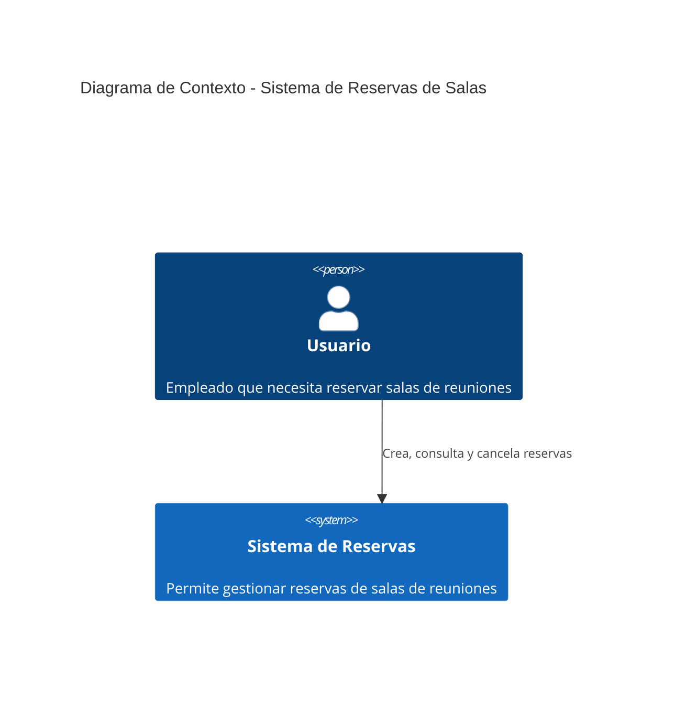
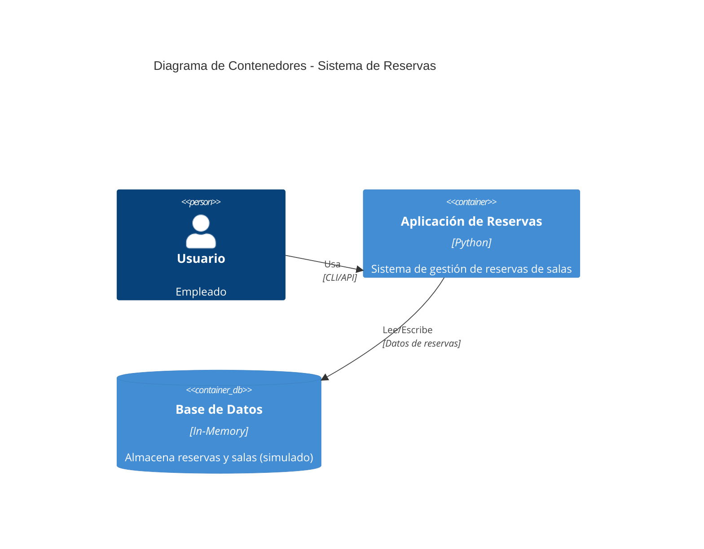
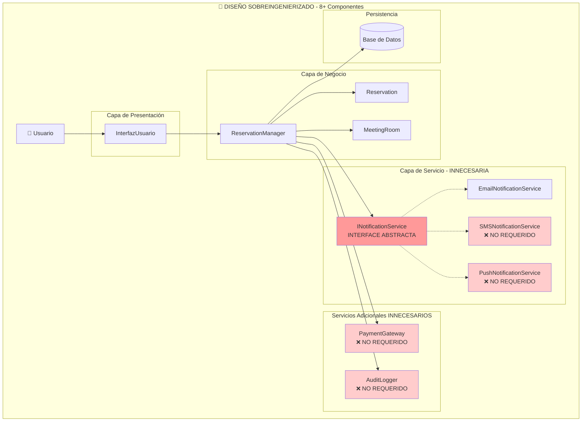
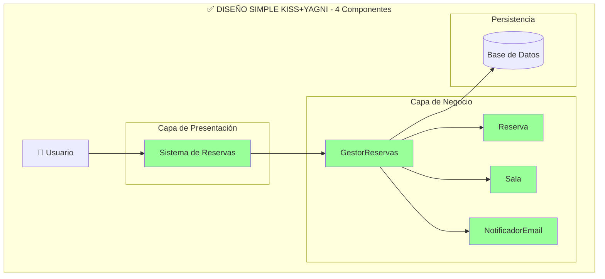
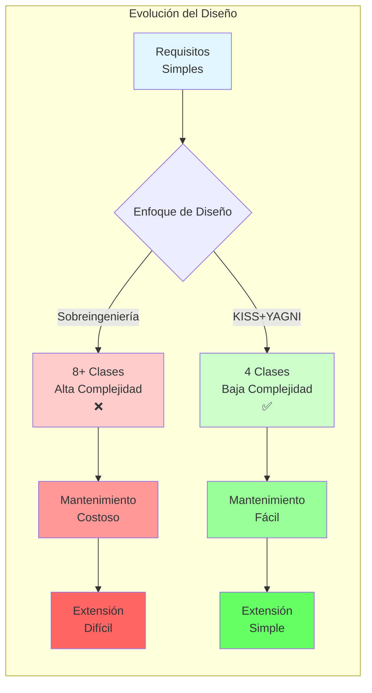
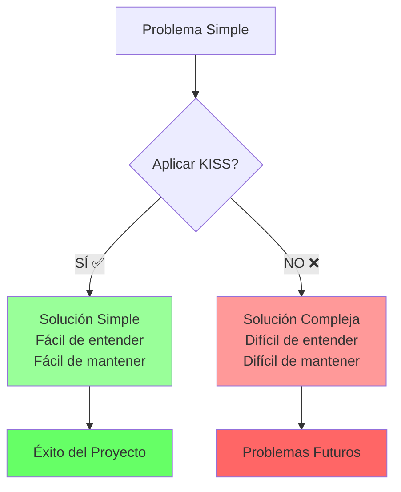
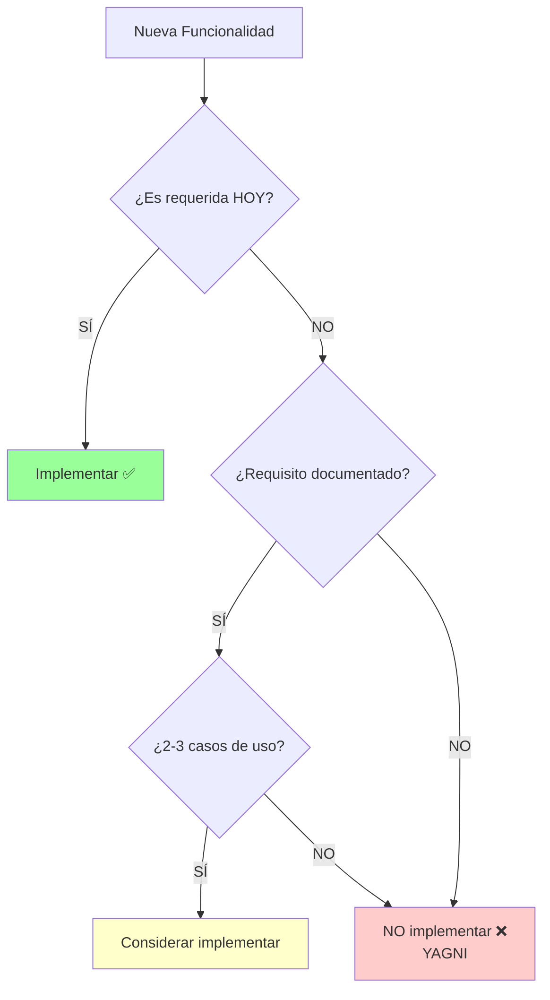

# 📊 Diagramas C4 - Comparación KISS vs Sobreingeniería

Este documento presenta los diagramas C4 (Context, Container, Component) para comparar ambos diseños del sistema de reservas de salas.

## 📚 Índice
- [Nivel 1: Diagrama de Contexto](#nivel-1-diagrama-de-contexto)
- [Nivel 2: Diagrama de Contenedores](#nivel-2-diagrama-de-contenedores)
- [Nivel 3: Diagrama de Componentes - Sobreingeniería](#nivel-3-diagrama-de-componentes---sobreingeniería)
- [Nivel 3: Diagrama de Componentes - KISS+YAGNI](#nivel-3-diagrama-de-componentes---kissyagni)
- [Comparación Visual](#comparación-visual)

---

## Nivel 1: Diagrama de Contexto

**Ambos diseños comparten el mismo contexto de sistema**



**Descripción:**
- **Usuario**: Empleados de la empresa que necesitan reservar salas
- **Sistema de Reservas**: Aplicación para gestionar las reservas de manera simple y eficiente

---

## Nivel 2: Diagrama de Contenedores

**Ambos diseños tienen la misma arquitectura de contenedores**



**Descripción:**
- **Aplicación**: Sistema Python que maneja la lógica de negocio
- **Base de Datos**: Almacenamiento en memoria (para la demo)

---

## Nivel 3: Diagrama de Componentes - Sobreingeniería

### ❌ Diseño Sobreingenierizado (Anti-Patrón)



**Problemas identificados:**
- ❌ **8+ clases** cuando solo se necesitan 4
- ❌ **3 canales de notificación** cuando solo se usa email
- ❌ **Interface abstracta** sin justificación real
- ❌ **PaymentGateway** para algo que es gratis
- ❌ **AuditLogger** sin requisito de compliance
- ❌ **Alta complejidad** para funcionalidad simple

**Métricas:**
- **Clases**: 11
- **Dependencias**: 15+
- **Complejidad ciclomática**: Alta
- **Tiempo de desarrollo**: ~3 semanas
- **Mantenibilidad**: Baja

---

## Nivel 3: Diagrama de Componentes - KISS+YAGNI

### ✅ Diseño Simple (Patrón Correcto)



**Beneficios:**
- ✅ **Solo 4 clases** necesarias
- ✅ **1 canal de notificación** (email) según requisito
- ✅ **Sin abstracciones innecesarias**
- ✅ **Sin funcionalidades especulativas**
- ✅ **Código simple y directo**
- ✅ **Fácil de mantener y extender**

**Métricas:**
- **Clases**: 4
- **Dependencias**: 5
- **Complejidad ciclomática**: Baja
- **Tiempo de desarrollo**: ~1 semana
- **Mantenibilidad**: Alta

---

## Comparación Visual

### 📊 Tabla Comparativa

| Aspecto | Sobreingeniería ❌ | KISS+YAGNI ✅ |
|---------|-------------------|---------------|
| **Componentes** | 11 clases | 4 clases |
| **Interfaces abstractas** | 1 (innecesaria) | 0 |
| **Canales notificación** | 3 (Email, SMS, Push) | 1 (Email) |
| **Servicios extras** | PaymentGateway, AuditLogger | Ninguno |
| **Dependencias** | 15+ | 5 |
| **Líneas de código** | ~500 líneas | ~200 líneas |
| **Tiempo desarrollo** | 3 semanas | 1 semana |
| **Bugs potenciales** | Alto | Bajo |
| **Facilidad mantenimiento** | Baja | Alta |
| **Extensibilidad futura** | Difícil (mucho acoplamiento) | Fácil (bajo acoplamiento) |

### 🎯 Diagrama de Flujo de Complejidad



---

## 🔍 Análisis Detallado por Capa

### Capa de Notificaciones

**Sobreingeniería:**
```
INotificationService (Interface abstracta)
├── EmailNotificationService
├── SMSNotificationService ❌ NO REQUERIDO
└── PushNotificationService ❌ NO REQUERIDO
```
**Problemas:** Abstracción prematura, canales no solicitados

**KISS+YAGNI:**
```
NotificadorEmail (Clase concreta)
```
**Ventajas:** Solo lo necesario, sin abstracciones innecesarias

---

### Capa de Servicios Adicionales

**Sobreingeniería:**
```
PaymentGateway ❌ NO REQUERIDO
├── Integración con pasarela de pago
├── Validación de tarjetas
└── Procesamiento de transacciones
```
**Problemas:** Las salas son gratis, no hay requisito de pago

**KISS+YAGNI:**
```
(No existe - no es necesario)
```
**Ventajas:** No se desarrolla lo que no se necesita

---

## 💡 Principios Aplicados

### KISS (Keep It Simple, Stupid)



### YAGNI (You Aren't Gonna Need It)



---

## 🎓 Conclusiones

### Cuándo usar cada enfoque:

**Diseño Simple (KISS+YAGNI) ✅**
- ✅ Requisitos claros y acotados
- ✅ MVP o prototipos
- ✅ Proyectos pequeños/medianos
- ✅ Equipos pequeños
- ✅ Presupuesto/tiempo limitado

**Diseño Complejo (Solo si es necesario) ⚠️**
- ⚠️ Requisitos de escalabilidad probados
- ⚠️ Múltiples clientes con necesidades diferentes
- ⚠️ Regulaciones estrictas (compliance)
- ⚠️ Sistemas críticos de misión
- ⚠️ Con justificación costo-beneficio documentada

### Regla de oro:

> **"Empieza simple, agrega complejidad solo cuando tengas evidencia de que la necesitas"**

---

## 📖 Referencias

- **C4 Model**: https://c4model.com/
- **KISS Principle**: Keep It Simple, Stupid
- **YAGNI Principle**: You Aren't Gonna Need It
- **Martin Fowler - Software Design**: https://martinfowler.com/

---

**💡 Tip para la exposición:**
Muestra estos diagramas junto con las demos de código para ilustrar visualmente la diferencia entre ambos enfoques. Los diagramas C4 ayudan a la audiencia a entender la arquitectura de un vistazo.
