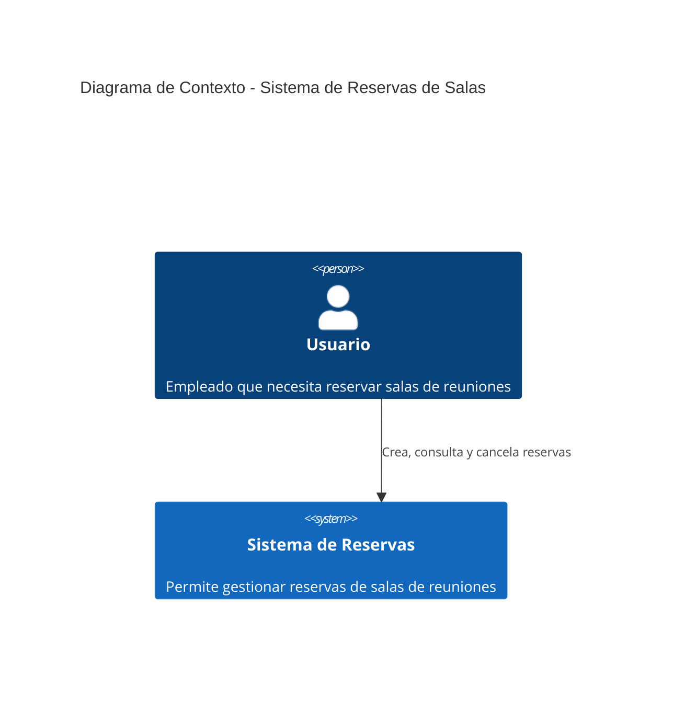
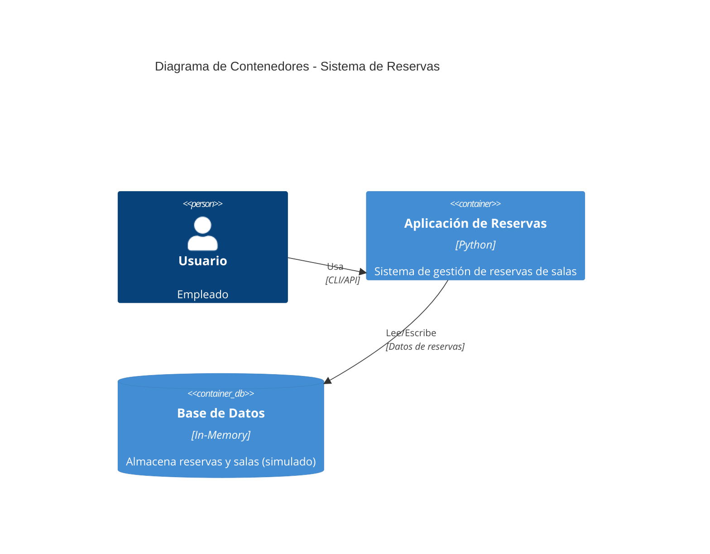
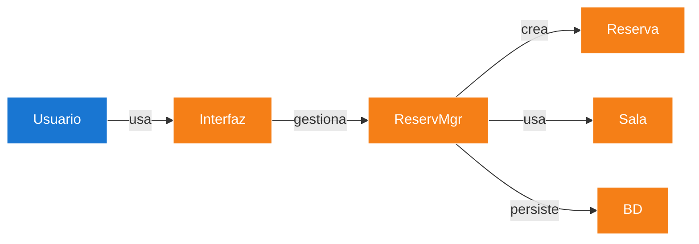
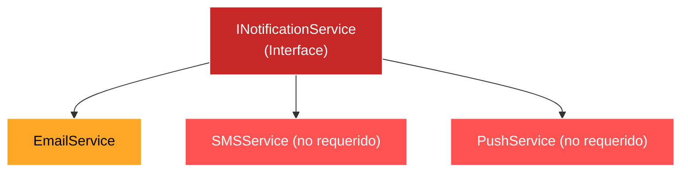
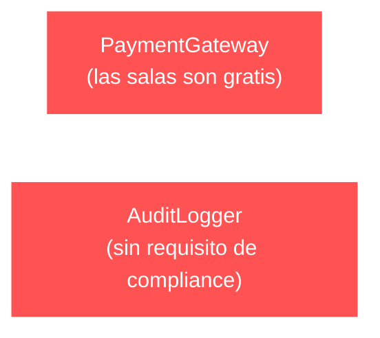
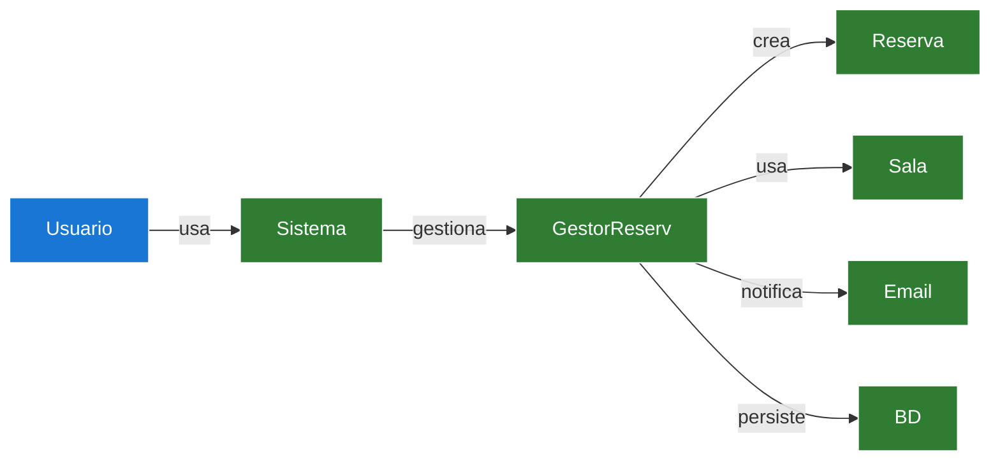
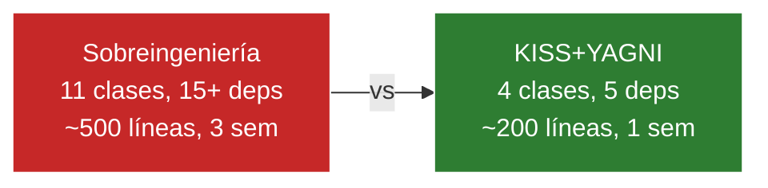
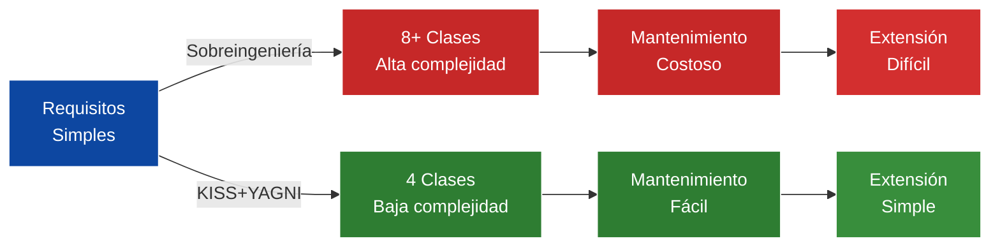
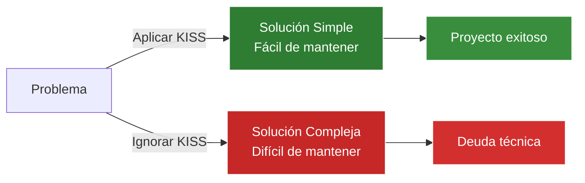
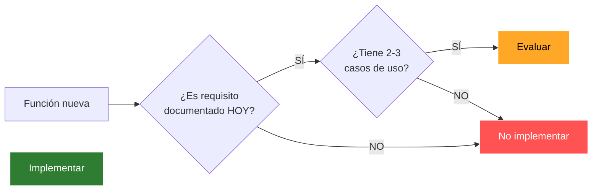

# Diagramas C4 - KISS vs Sobreingeniería

Comparación arquitectónica usando el modelo C4 (Context, Container, Component) aplicada al sistema de reservas de salas. El objetivo es visualizar cómo un mismo problema puede resolverse con dos niveles de complejidad muy distintos.

## Índice

- [Nivel 1: Contexto](#nivel-1-diagrama-de-contexto)
- [Nivel 2: Contenedores](#nivel-2-diagrama-de-contenedores)
- [Nivel 3: Componentes - Sobreingeniería](#nivel-3-diagrama-de-componentes---sobreingeniería)
- [Nivel 3: Componentes - KISS+YAGNI](#nivel-3-diagrama-de-componentes---kissyagni)
- [Comparación](#comparación-visual)

---

## Nivel 1: Diagrama de Contexto

El contexto del sistema es el mismo independientemente del enfoque de diseño.

Un empleado interactúa con el sistema para crear, consultar o cancelar reservas de salas.

---

## Nivel 2: Diagrama de Contenedores

A nivel de contenedores, ambos enfoques son idénticos: una app Python con almacenamiento en memoria.

La diferencia entre ambos enfoques no está en la infraestructura, sino en cómo se organiza internamente la lógica.

---

## Nivel 3: Diagrama de Componentes - Sobreingeniería

### Diseño Sobreingenierizado (Anti-Patrón)

Arquitectura base del enfoque sobreingenierizado:

Capa de servicios con abstracción innecesaria:

Servicios que se implementaron sin tener un requisito real:

**Problemas de este enfoque:**

- Se crearon 11 clases cuando el problema se resuelve con 4
- Se implementaron 3 canales de notificación (Email, SMS, Push) cuando solo Email era requisito
- Se introdujo una interfaz abstracta sin justificación técnica
- PaymentGateway para un servicio que es gratuito
- AuditLogger sin ningún requisito de compliance

| Métrica | Valor |
|---------|-------|
| Clases | 11 |
| Dependencias | 15+ |
| Líneas de código | ~500 |
| Tiempo estimado | 3 semanas |

---

## Nivel 3: Diagrama de Componentes - KISS+YAGNI

### Diseño Simple (KISS + YAGNI)

Arquitectura directa, sin capas innecesarias:

Comparación directa de complejidad:

Con este enfoque se usan solo 4 clases, un único canal de notificación (el que realmente se necesita), sin abstracciones prematuras ni funcionalidades especulativas. El código es directo y fácil de mantener.

---

## Comparación Visual

### Tabla Comparativa

| Aspecto                     | Sobreingeniería              | KISS+YAGNI                |
| --------------------------- | ---------------------------- | ------------------------- |
| **Componentes**             | 11 clases                    | 4 clases                  |
| **Interfaces abstractas**   | 1 (innecesaria)              | 0                         |
| **Canales notificación**    | 3 (Email, SMS, Push)         | 1 (Email)                 |
| **Servicios extras**        | PaymentGateway, AuditLogger  | Ninguno                   |
| **Dependencias**            | 15+                          | 5                         |
| **Líneas de código**        | ~500 líneas                  | ~200 líneas               |
| **Tiempo desarrollo**       | 3 semanas                    | 1 semana                  |
| **Bugs potenciales**        | Alto                         | Bajo                      |
| **Facilidad mantenimiento** | Baja                         | Alta                      |
| **Extensibilidad futura**   | Difícil (mucho acoplamiento) | Fácil (bajo acoplamiento) |

### Impacto en cascada de la complejidad

La complejidad no justificada se propaga: más código implica más mantenimiento, más bugs y más dificultad para extender.

---

## Análisis por Capa

### Notificaciones

En el diseño sobreingenierizado se creó una interfaz abstracta `INotificationService` con tres implementaciones (Email, SMS, Push), cuando el único requisito era enviar emails. Se trata de una abstracción prematura: se diseñó para un futuro que no se necesita hoy.

El enfoque simple usa una clase concreta `NotificadorEmail`. Si mañana se necesita SMS, se refactoriza en ese momento.

### Servicios Adicionales

El `PaymentGateway` se implementó asumiendo que las salas podrían cobrarse algún día. Las salas son gratis. El `AuditLogger` se añadió "por si acaso" sin que exista ningún requisito regulatorio.

En el diseño simple estos servicios no existen, porque no hay necesidad real.

---

## Principios Aplicados

### KISS - Keep It Simple, Stupid

### YAGNI - You Aren't Gonna Need It

---

## Conclusiones

El diseño simple es la opción correcta cuando los requisitos son claros y acotados: MVPs, proyectos pequeños/medianos, equipos reducidos o con restricciones de tiempo.

La complejidad adicional solo se justifica cuando hay evidencia concreta: requisitos de escalabilidad demostrados, múltiples clientes con necesidades divergentes, regulaciones estrictas o sistemas de misión crítica. Siempre con un análisis costo-beneficio que lo respalde.

> "Empieza simple. Agrega complejidad solo cuando tengas evidencia de que la necesitas."

---

## Referencias

- C4 Model: https://c4model.com/
- Martin Fowler - Software Design: https://martinfowler.com/
